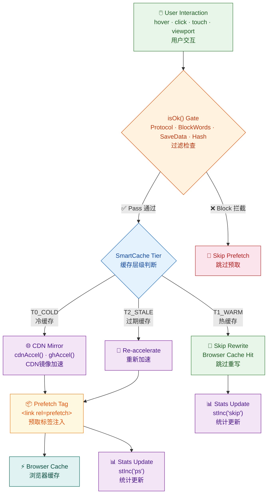

  

<h1 align="center">🚀 Web Rocket Accelerator — 网页火箭加速器</h1>

  
  

---

## 📖 Overview / 概述

**Web Rocket Accelerator** is a high-performance Tampermonkey script, specifically designed for accelerators that access web pages.

一个高性能油猴脚本，专为访问web网页的加速器。。

---

## 🏗️ Architecture / 架构设计

### System Flow / 系统流程

---

## 🚀 Install / 安装

1. Install a userscript manager: [Tampermonkey](https://www.tampermonkey.net/) · [Violentmonkey](https://violentmonkey.github.io/) · [ScriptCat](https://docs.scriptcat.org/)
2. Open the manager → **Import** → select `webRocketAccelerator.user.js` → **Save**

先安装脚本管理器，然后导入脚本文件保存即可。

---

## 🗒️ Changelog / 更新日志

### v5.7.0 (2026-05-13)
**Bug Fixes:**
- 🔒 **[SEC]** `modal()`: 完全重构为 DOM API 构建，移除了 `innerHTML` 直接拼接用户可控字符串，消除 XSS 风险
- 🌐 **[FIX]** 补充缺失的 `@connect` 指令：`cdn.jsdelivr.net`、`registry.npmmirror.com`、`cdn.sep.cc`、`fonts.loli.net`、`lib.baomitu.com`
- 📊 **[FIX]** `gh_m`（原生反向代理）统计量此前永不递增；现根据实际使用的镜像类型正确区分 `gh`（jsDelivr CDN）vs `gh_m`（gh-proxy）
- 🔄 **[FIX]** `tryCreateEntry` 重试退避从 `200*(n-1)` 修正为真正的指数退避 `100*(1<<(n-3))`（n=3→100ms, 4→200ms, 5→400ms）
- 🛡️ **[FIX]** `_wraPC` 属性改用模块级布尔变量，避免被页面 JS 覆盖

**Improvements:**
- 📌 使用 `C.minDelay` 替代硬编码 `15` 在 range input min 属性
- ⚡ GitHub 镜像函数返回类型统一为 `{url, mirror}`，消除 `accelerateUrl` 中的类型不一致

---

## 📄 License / 许可证

**GNU Affero General Public License v3.0** (AGPL-3.0)

See [LICENSE](LICENSE) for full terms. 详见 LICENSE 文件。

---

## 👤 Author / 作者

Powered by Hermes Agent & 凌泉素问 — [GitHub Profile](https://github.com/golegen)
