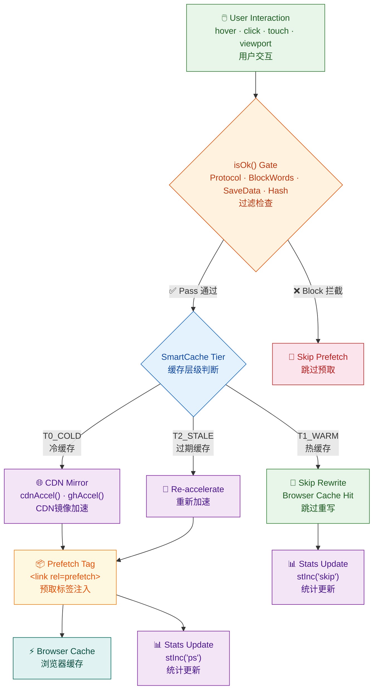
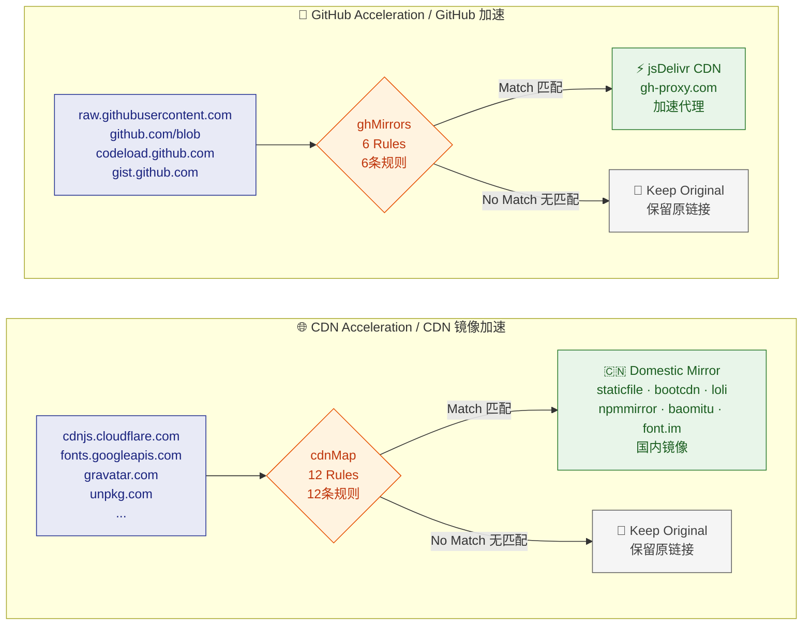
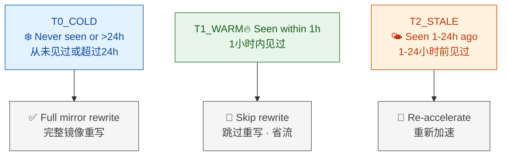

  

<h1 align="center">🚀 Web Rocket Accelerator — 网页火箭加速器</h1>

  
  

---

## 📖 Overview / 概述

**Web Rocket Accelerator** is a self-contained userscript that speeds up web browsing by intelligently prefetching links, applying multi-layer CDN mirror acceleration (12+ regional mirrors), and optimizing resource loading — compatible with Tampermonkey / Violentmonkey / ScriptCat.

一个高性能油猴脚本，在点击链接前智能预取目标页面，对常见 CDN 提供商应用多层镜像加速（12+ 区域节点），优化资源加载。

---

## ✨ Features / 核心功能

**🎯 Intelligent Prefetching / 智能预取**

Multi-event triggers: `hover` · `mousedown` · `touchstart` · viewport entry via `IntersectionObserver` (250px margin). Dynamic content support via `MutationObserver`. Speculation Rules API for Chrome-native prerender on top cross-origin links.

多事件触发（悬停 · 点击 · 触摸 · 视口进入），动态内容监控，Chrome 原生预渲染。

**🌐 CDN & GitHub Mirror Acceleration / 镜像加速**

12 CDN mirror rules covering Cloudflare, Google Fonts, Gravatar, jsDelivr, unpkg, jQuery, BootstrapCDN, FontAwesome — each with priority-ordered fallback mirrors. GitHub static resources (raw content, blob files, releases, archives, gists) accelerated via jsDelivr and gh-proxy — **github.com page navigation stays on github.com, preserving your login session**.

12 条 CDN 镜像规则覆盖主流海外 CDN，每条规则含优先级排序的多个国内镜像。GitHub 静态资源（raw 内容、blob 文件、releases、archives、gist）通过 jsDelivr + gh-proxy 加速——**github.com 页面导航保留在原站，登录会话不受影响**。

**💾 Smart Cache Tiering / 智能缓存分层**

Three-tier adaptive strategy — see the Mermaid diagram below in the Architecture section.

三级自适应缓存策略（详见下方架构图中的 Mermaid 流程图）。

**🎨 Warm Light UI / 暖光护眼界面**

Card-based settings and statistics panels with warm cream palette, vertical bilingual labels (EN above, ZH below), 2-column grid layout, frosted glass overlay.

卡片式设置与统计面板，暖白配色，垂直双语排版，毛玻璃遮罩。

---

## 🏗️ Architecture / 架构设计

### System Flow / 系统流程

### CDN & GitHub Acceleration Pipeline / 加速管线

### Smart Cache Tiers / 智能缓存分级

---

## 🚀 Install / 安装

1. Install a userscript manager: [Tampermonkey](https://www.tampermonkey.net/) · [Violentmonkey](https://violentmonkey.github.io/) · [ScriptCat](https://docs.scriptcat.org/)
2. Open the manager → **Import** → select `webRocketAccelerator.user.js` → **Save**

先安装脚本管理器，然后导入脚本文件保存即可。

---

## ⚙️ Configuration / 配置选项

Accessible via userscript manager menu or floating badge:

通过脚本管理器菜单或浮动徽章访问：

- **Show Acceleration Indicator** / 显示加速指示器 — Floating badge for recent accelerations (Off)
- **Speculation Rules Prerender** / 原生预测渲染 — Chrome-native prerender (On)
- **Universal CDN Mirror** / 通用 CDN 国内镜像 — Replace overseas CDN with domestic mirrors (On)
- **GitHub Mirror Proxy** / GitHub 镜像代理 — Route GitHub via jsDelivr/gh-proxy (On)
- **Resource Tag Interception** / 资源标签拦截 — Rewrite resource tag URLs (On)
- **Adaptive Smart Cache** / 自适应智能缓存 — Tiered cold/warm/stale strategy (On)
- **Lazy Loading Optimizer** / 懒加载优化器 — Add loading="lazy", defer scripts (On)
- **Hover Delay** / 悬停延时 — Prefetch trigger delay 15-300ms (65ms)

---

## 📄 License / 许可证

**GNU Affero General Public License v3.0** (AGPL-3.0)

See [LICENSE](LICENSE) for full terms. 详见 LICENSE 文件。

---

## 👤 Author / 作者

凌泉素问 — [GitHub Profile](https://github.com/golegen)

---

  Made with ⚡ by <a href="https://github.com/golegen">golegen</a> 
  <small style="color:#8b7d7b">用 ⚡ 打造 · Powered by Hermes Agent</small>

