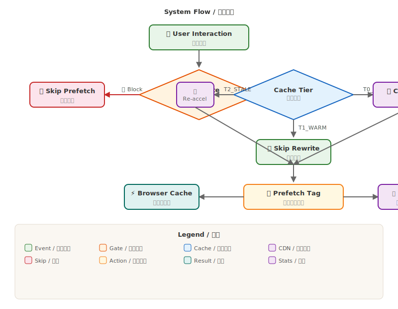

  

<h1 align="center">🚀 Web Rocket Accelerator — 网页火箭加速器</h1>

  
  

---

## 📖 Overview / 概述

**Web Rocket Accelerator** is a self-contained userscript that speeds up web browsing by intelligently prefetching links, applying multi-layer CDN mirror acceleration (12+ regional mirrors), and optimizing resource loading — compatible with Tampermonkey / Violentmonkey / ScriptCat.

一个高性能油猴脚本，在点击链接前智能预取目标页面，对常见 CDN 提供商应用多层镜像加速（12+ 区域节点），优化资源加载。

---

## ✨ Features / 核心功能

**🎯 Intelligent Prefetching / 智能预取**

Multi-event triggers: `hover` · `mousedown` · `touchstart` · viewport entry via `IntersectionObserver`. Dynamic content support via `MutationObserver`. Speculation Rules API for Chrome-native prerender.

多事件触发（悬停 · 点击 · 触摸 · 视口进入），动态内容监控，Chrome 原生预渲染。

**🌐 CDN & GitHub Acceleration / CDN 与 GitHub 加速**

12 CDN mirror rules covering Cloudflare, Google Fonts, Gravatar, jsDelivr, unpkg, and more — each with priority-ordered fallback mirrors. GitHub static resources accelerated via jsDelivr and gh-proxy, while **page navigation stays on github.com** preserving login sessions.

12 条 CDN 镜像规则覆盖主流海外 CDN，GitHub 静态资源通过 jsDelivr + gh-proxy 加速，页面导航保留在原站。

**💾 Smart Cache Tiering / 智能缓存分层**

Three-tier adaptive strategy (cold/warm/stale) minimizing redundant mirror rewrites.

三级自适应缓存策略（冷/热/过期），减少重复镜像重写。

**🎨 Warm Light UI / 暖光护眼界面**

Card-based statistics and settings panels with warm cream palette, vertical bilingual labels, 2-column grid layout.

卡片式统计与设置面板，暖白配色，垂直双语排版。

---

## 🏗️ Architecture / 架构设计

  

---

## 🚀 Install / 安装

1. Install a userscript manager: [Tampermonkey](https://www.tampermonkey.net/) · [Violentmonkey](https://violentmonkey.github.io/) · [ScriptCat](https://docs.scriptcat.org/)
2. Open the manager → **Import** → select `webRocketAccelerator.user.js` → **Save**

先安装脚本管理器，然后导入脚本文件保存即可。

---

## 📄 License / 许可证

**GNU Affero General Public License v3.0** (AGPL-3.0)

See [LICENSE](LICENSE) for full terms. 详见 LICENSE 文件。

---

## 👤 Author / 作者

凌泉素问 — [GitHub Profile](https://github.com/golegen)

---

  Made with ⚡ by <a href="https://github.com/golegen">golegen</a> 

