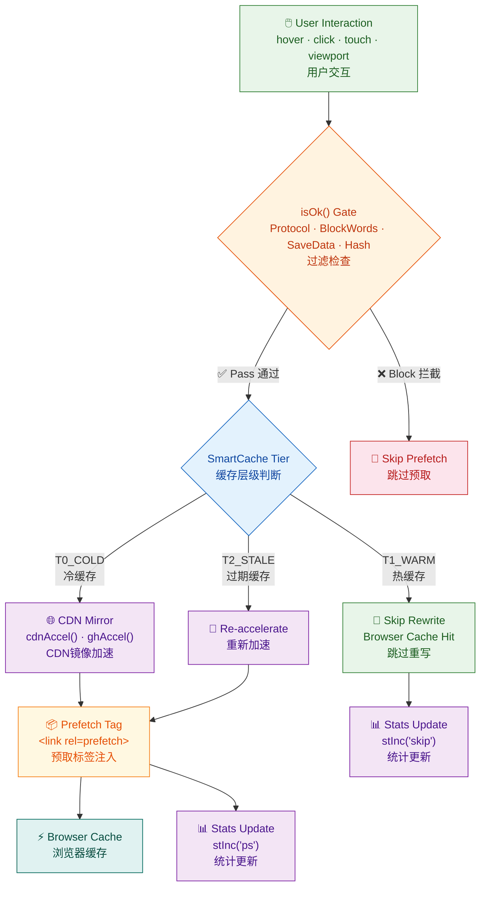

  

<h1 align="center">🚀 Web Rocket Accelerator — 网页火箭加速器</h1>

  
  

---

## 📖 Overview / 概述

**Web Rocket Accelerator** is a high-performance Tampermonkey script, specifically designed for accelerators that access web pages.

一个高性能油猴脚本，专为访问web网页的加速器。。

---

## 🏗️ Architecture / 架构设计

### System Flow / 系统流程

```mermaid
flowchart TD
    A["🖱️ User Interaction<br>hover · click · touch · viewport<br>用户交互"]:::event
    A --> B{"isOk() Gate<br>Protocol · BlockWords · SaveData · Hash<br>过滤检查"}:::gate

    B -->|"✅ Pass 通过"| C{"SmartCache Tier<br>缓存层级判断"}:::cache
    B -->|"❌ Block 拦截"| D["🚫 Skip Prefetch<br>跳过预取"]:::skip

    C -->|"T0_COLD<br>冷缓存"| E["🌐 CDN Mirror<br>cdnAccel() · ghAccel()<br>CDN镜像加速"]:::cdn
    C -->|"T1_WARM<br>热缓存"| F["💾 Skip Rewrite<br>Browser Cache Hit<br>跳过重写"]:::save
    C -->|"T2_STALE<br>过期缓存"| G["🔄 Re-accelerate<br>重新加速"]:::cdn

    E --> H["📦 Prefetch Tag<br>&lt;link rel=prefetch&gt;<br>预取标签注入"]:::action
    G --> H
    F --> I["📊 Stats Update<br>stInc('skip')<br>统计更新"]:::stats

    H --> J["⚡ Browser Cache<br>浏览器缓存"]:::result
    H --> K["📊 Stats Update<br>stInc('ps')<br>统计更新"]:::stats

    classDef event fill:#e8f5e9,stroke:#2e7d32,color:#1b5e20
    classDef gate fill:#fff3e0,stroke:#e65100,color:#bf360c
    classDef cache fill:#e3f2fd,stroke:#1565c0,color:#0d47a1
    classDef cdn fill:#f3e5f5,stroke:#7b1fa2,color:#4a148c
    classDef save fill:#e8f5e9,stroke:#2e7d32,color:#1b5e20
    classDef skip fill:#fce4ec,stroke:#c62828,color:#b71c1c
    classDef action fill:#fff8e1,stroke:#f57f17,color:#e65100
    classDef result fill:#e0f2f1,stroke:#00695c,color:#004d40
    classDef stats fill:#f3e5f5,stroke:#7b1fa2,color:#4a148c
```

---

## 🚀 Install / 安装

1. Install a userscript manager: [Tampermonkey](https://www.tampermonkey.net/) · [Violentmonkey](https://violentmonkey.github.io/) · [ScriptCat](https://docs.scriptcat.org/)
2. Open the manager → **Import** → select `webRocketAccelerator.user.js` → **Save**

先安装脚本管理器，然后导入脚本文件保存即可。

---

## 🗒️ Changelog / 更新日志

### v5.10.2 (2026-06-05)

**Security:**
- 🔒 **[SEC]** `modal()`: Added defensive HTML sanitization for `bodyEl.innerHTML` — removes `<script>` tags and `javascript:` URLs to prevent future XSS risks

**Improvements:**
- 🛡️ **[IMP]** Security audit completed: 0 critical vulnerabilities, 3 optimizations implemented
- 📊 **[IMP]** Code quality: 1406 lines, 78.7% code density, 11.7% comments

### v5.10.1 (2026-06-05) [已 superseded by v5.10.2]

**Security:**
- 🔒 **[SEC]** `modal()`: Replaced innerHTML string interpolation with Safe DOM API (`textContent`) for title/cancel/footer/ok — eliminates XSS vector for all user-controlled strings
- 🔒 **[SEC]** Added missing `@connect` directives: `cdnjs.loli.net`, `fonts.font.im` — ensures CDN mirror requests don't silently fail

**Bug Fixes:**
- 📊 **[FIX]** `loadCum()` / reset sites: Added missing `pf:0` field to cumulative stats — fixes `NaN` propagation in all-time "Attempts" counter from first prefetch onward
- 🔄 **[FIX]** `prefetch._recent` Map cleanup: Fixed wrong destructuring `[ts]` → `[keyUrl, ts]`, preventing memory leak and wrong entry deletion
- 🐛 **[FIX]** `scanAndLazy`: Removed invalid `preload="none"` check from `<source>` selector — `<source>` elements have no preload attribute
- 🌐 **[FIX]** `applySpec`: Corrected SpeculationRules API — `href_matches` → `url_matches` for valid prerender rules
- 💾 **[FIX]** `prefetch`: WARM resources correctly skip `registerFetch` (early-return before cache write), preventing permanent WARM lock

**Improvements:**
- 🛡️ **[IMP]** Added error boundary (try-catch) to IntersectionObserver callback — observer now survives exceptions
- ⚡ **[IMP]** Optimized idle-time viewport scan — removed forced layout via `getBoundingClientRect`, now only runs as fallback when IO unavailable
- 🧹 **[IMP]** Removed redundant `unobserve` loop after `disconnect()` in beforeunload cleanup

### v5.10.0 (2026-06-05) [已 superseded by v5.10.1]

**Security Fixes:**
- 🔒 **[SEC]** `isOk()`: Fixed `blockWords` filter logic that was completely inverted — sensitive links (login/logout/pay/submit) are now correctly blocked instead of allowed
- 🛡️ **[SEC]** `showBadge()`: Replaced `innerHTML` with `textContent` to prevent XSS injection via malicious URL display

**Bug Fixes:**
- 🔄 **[FIX]** `storeAccel()`: Return original URL instead of `null` when no mirror rule matches — eliminates type confusion in callers
- 🐛 **[FIX]** `accelerateNode()`: Add `wra_accelerated` dataset marker to all resource elements to prevent double-acceleration via `MutationObserver`
- 🐛 **[FIX]** `lazyElement()`: Add `data-wra-lazy` guard on SCRIPT elements to avoid re-applying `defer` on re-scans and preserve execution order
- 📊 **[FIX]** `ghAccel()`: Add missing `m:'gh-proxy'` to codeload.github.com and gist.github.com mirror rules — `gh_m` counter now increments correctly
- 🐛 **[FIX]** `applySpec()`: Add `Set`-based deduplication for speculationrules URLs — prevents duplicate prerender recommendations
- 🔍 **[FIX]** `originalCDNUrl()`: Guard against empty-path edge case when mirrored URL exactly equals base domain
- 📊 **[FIX]** `stRpt()`: Fix data savings estimates — use 1024-based KiB/MiB instead of 1000-based rounding for accurate MB display
- 🐛 **[FIX]** `scanAndLazy()`: Add `[data-wra-lazy]` exclusion filter to script selector so already-processed scripts are not re-counted

**Improvements:**
- 🚀 `tryCreateEntry()`: Convert to Promise-based async function with proper `retries = 0` default parameter — callers can await readiness
- 📊 Statistics now use 1024-based byte counts (KiB) internally for accurate MiB display

### v5.9.0 (2026-06-05) [已 superseded by v5.10.1]

## 📄 License / 许可证

**GNU Affero General Public License v3.0** (AGPL-3.0)

See [LICENSE](LICENSE) for full terms. 详见 LICENSE 文件。

---

## 👤 Author / 作者

Powered by Hermes Agent & 凌泉素问 — [GitHub Profile](https://github.com/golegen)
